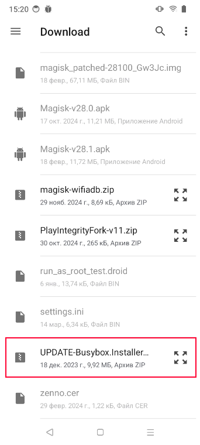
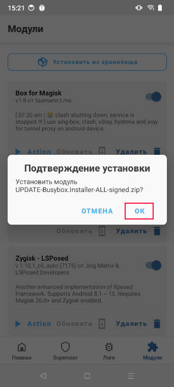
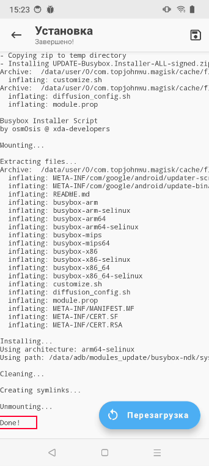
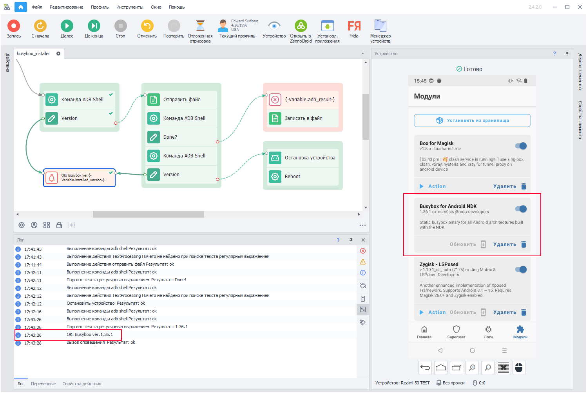

:::info **Пожалуйста, ознакомьтесь с [*Правилами использования материалов на данном ресурсе*](../Disclaimer).**
:::
_______________________________________________
## Описание.
BusyBox представляет собой набор UNIX-утилит командной строки. Используется в функциях:
- [Сохранения и восстановления данных приложения](../Android/Enterprise/App#сохранить-данные-приложения);
- [Установки прокси в режиме Clash](../Android/Enterprise/setting#clash) *(необходима версия BusyBox не ниже 1.36.1)*;  
_______________________________________________  
## Установка вручную.
Для установки модуля вам понадобится смартфон с [**Magisk**](https://github.com/topjohnwu/Magisk).

Скачать модуль [Busybox for Android NDK 1.36.1](https://www.dropbox.com/scl/fi/079hbifq0keal5gmu9d1i/UPDATE-Busybox.Installer.v1.36.1-ALL-signed.zip?rlkey=r76ihn7ez64lo0a2j6zq8zoph&st=h8da6r8y&dl=0) нужно в папку телефона `sdcard/Download/` и установить с помощью стандартного меню.  

### **1. Открываем Magisk → раздел *Модули* → Установить из хранилища.**

### **2. Находим установщик среди скачанных файлов.**

### **3. Подтверждаем установку.**
  

### **4. В логе появится надпись `Done!` если установка пройдёт успешно.**

:::warning **После установки необходимо перезагрузить устройство.**
:::
_______________________________________________ 
## Автоматическая установка (ZennoDroid 2.4.2+).
Мы подготовили [**Шаблон для установки Busybox 1.36.1**](https://www.dropbox.com/scl/fi/079hbifq0keal5gmu9d1i/UPDATE-Busybox.Installer.v1.36.1-ALL-signed.zip?rlkey=r76ihn7ez64lo0a2j6zq8zoph&e=1&st=h8da6r8y&dl=0), чтобы вам было легче развернуть BusyBox на большом количестве устройств. Он проверяет текущую версию, и если она ниже 1.36.1, то автоматически устанавливает актуальный модуль для Magisk.  

:::info **После установки телефон автоматически перезагрузится.**
:::  

Затем нужно снова подключиться к устройству и запустить шаблон.  

|     | 
| :--------: | 
| **Сообщение в логе `OK: Busybox ver. 1.36.1` говорит о том, что BusyBox установлен и работает правильно.**  |
