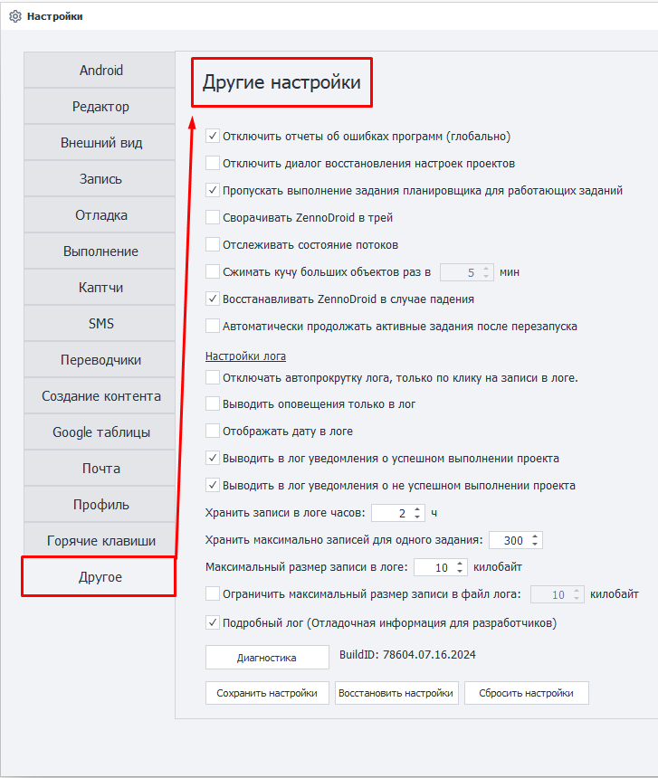
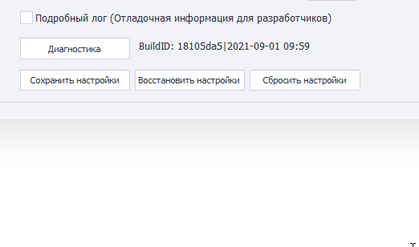

---
sidebar_position: 14
title: Другое
description: Другие доступные настройки.
---  
:::info **Пожалуйста, ознакомьтесь с [*Правилами использования материалов на данном ресурсе*](../Disclaimer).**
:::
_______________________________________________  
## Внешний вид.  
  

## Общие настройки.  
### Отключить отчёты об ошибках программ (глобально).  
Иногда из-за внутренних проблем устройство может крашнуться. ZennoDroid отслеживает это и старается восстановить его работу. Однако если при этом будет висеть окно с уведомлениями о случившейся ошибке, то есть вероятность, что устройство не сможет перезагрузиться.  

### Отключить диалог восстановления настроек проектов.  
Эта опция отключает возможность восстановления настроек в случае аварийного завершения программы. Она может пригодиться в ситуации, когда данное окно блокирует автозапуск ZennoDroid.  

:::warning **Не рекомендуем отключать данную опцию.**
:::  

### Пропускать выполнение задания планировщика для работающих заданий.
Если проект уже выполняется в момент, когда вы хотите запустить его в планировщике, то это задание планировщика запустится только после окончания основного выполнения.  

### Сворачивать ZennoDroid в трей.  
При сворачивании окна программы, она будет выгружаться в трей.  

### Отслеживать состояние потоков.  
Включает отслеживание состояния потоков в программе для статистики. Эта информация может быть полезна только при обращении в поддержку. Поэтому **не советуем включать эту опцию просто так**.  

### Сжимать кучу больших объектов.
Эта функция полезна при обработке больших строковых данных. Например, при включенном автопоиске в ProxyChecker.  

Также задаётся временной промежуток, через которой будет происходить сжатие. Например, раз в 5 или 10 минут.  

### Автоматически продолжать активные задания после перезапуска.  
Отвечает за то, нужно ли продолжать выполнение заданий, которые были активны до последнего закрытия программы.
_______________________________________________
## Настройки лога.
### Отключать автопрокрутку лога, только по клику на записи в логе.  
Автопрокрутка записей в логе будет отключаться только после клика по любой из записей в логе.  

### Выводить оповещение только в лог.
Сообщения выводимые с помощью экшена [**Оповещение**](../Project%20Editor/Logic/Notification) будут отображаться только в логе, без всплывающего окна. Независимо от настроек экшена.  

### Отображать дату в логе.  
В логе дополнительно будет показываться текущая дата.  

### Выводить в лог уведомления об успешном выполнении проекта.  
При успешном выполнении проекта в лог будет выводиться сообщение об этом.  

### Выводить в лог уведомления о неуспешном выполнении проекта.
Если проект завершился неудачно, то в логе появится сообщение об этом.  

### Хранить записи в логе часов.  
Указываем максимальное время хранения записей в логе (в часах).  

### Хранить максимально записей для одного задания.  
Здесь можно задать максимальное количество записей в логе, которые относятся к одному заданию.  

:::info **Максимально допустимое значение — 9999.**
:::  

### Максимальный размер записи в логе.  
Устанавливаем ограничение на максимальный размер (в килобайтах) записи, которая может быть отображена в окне лога.  

### Ограничить максимальный размер записи в файл лога.  
Данная настройка ограничивает размер записи, которая может быть сохранена в файл лога. Мы рекомендуем включить это ограничение, если вы не работаете с большими данными, и вам не нужен полный лог. Так как это повысит производительность ZennoDroid и снизит потребление памяти.  

Файлы логов хранятся в директории с установленным ZennoDroid, в папке `Logs`. Возможный путь:  
`C:\Program Files\ZennoLab\RU\ZennoPoster Pro V7\7.4.0.0\Progs\Logs\`  

:::warning **Для вступления изменений требуется перезагрузка программы.**
:::  
_______________________________________________
## Прочее.  
### Подробный лог (Отладочная информация для разработчиков).  
Будет записываться более подробная информация о работе. Это может пригодиться при обращении в поддержку.  

### Диагностика.  
Эта кнопка запускает диагностическую утилиту (`diagnostic.exe`) для получения информации при возникновении проблем.  

После выполнения диагностики в директории с установленным ZennoDroid будет создан файл `report.zip`.  

:::tip **Читайте здесь [как правильно сделать диагностику](https://zennolab.atlassian.net/wiki/spaces/RU/pages/870419658).**
:::  

### Сохранить настройки.  
Открывается менеджер сохранения текущих настроек программы. Для корректной работы после запуска менеджера нужно вручную закрыть ZennoDroid и ProjectMaker, а затем уже нажать **Сохранить**.

### Восстановить настройки.  
Этот менеджер нужен для восстановления сохранённых настроек. Работает по такому же принципу, как и описанный выше менеджер.  

### Сбросить настройки.  
Сбрасывает текущие настройки программы до значений по умолчанию.  

### BuildId.  
Эта строка состоит из комбинации букв и цифр, уникальной для каждой версии программы. В ней также содержится дата релиза текущий версии.  

:::tip **Значение в этом поле можно выделить и скопировать.**  

:::
_______________________________________________  
## Полезные ссылки.   
- [**Окно лога**](../pm/Interface/Log_window).  
- [**Диспетчер заданий**](../get-started/Task_Manager).   
- [**Логика в ZD**](../category/логика-в-zd).