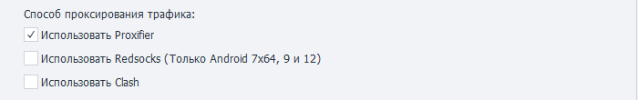

---
sidebar_position: 11
title: Проксирование трафика
description: Подробнее про Proxifier и Redsocks. 
---  
:::info **Пожалуйста, ознакомьтесь с [*Правилами использования материалов на данном ресурсе*](../Disclaimer).**
:::
_______________________________________________  
## Описание.  
ZennoDroid позволяет выбрать способ проксирования трафика для выполнения экшена [**Установка прокси**](../Android/ProLite/setting#как-поставить-прокси).  

Параметры задаются на вкладке [**Настройки Android**](../Android/ProLite/setting#как-поставить-прокси). По умолчанию используется **Proxifier**.  

  

**При одновременном включении обоих вариантов** проксирование трафика автоматически распределится в зависимости от образа устройства:  
- Android 7x64 и Android 9.0: **Redsocks2**;  
- Android 5.1 и Android 7x86: **Proxifier**.  
_______________________________________________ 
### [Proxifier](https://proxifier.com/).  
Это мощная и гибкая программа для перенаправления интернет-трафика через прокси-сервер. Она позволяет приложениям, которые не поддерживают работу через прокси, использовать его.   

Эмулятор будет проксироваться на основе его PID в Windows.  

:::tip **PID (Process Identifier).**  
Это уникальный числовой идентификатор, присваиваемый каждому процессу операционной системой. Он используется для управления процессами, их отслеживания и взаимодействия с ними.  

PID уникален только в пределах одного момента времени. Когда процесс завершается, его PID может быть повторно использован для нового процесса.
:::  
_______________________________________________ 
### Redsocks.  
Данная утилита нужна для перенаправления сетевого трафика через прокси-сервер, минуя необходимость ручной настройки прокси в каждом отдельном приложении. Выполняется прозрачный редиректор TCP/UDP-соединений в прокси.  

Все необходимые файлы копируются на устройство автоматически при первой установке прокси.

:::warning **Работает только на образах Android 7x64 и Android 9.0.**
:::  
_______________________________________________ 
### Clash. 
Это продвинутый прокси-клиент с возможностью маршрутизации трафика по заданным правилам. Он отличается мощным rule-based подходом и сам решает через какой сервер направить трафик в зависимости от настроенных правил. 

Простое и полное проксирование всего UDP-трафика — в отличие от redsocks, не требуется настраивать отдельное проксирование для каждого IP. Благодаря этому, при использовании прокси с поддержкой UDP, даже IP-адрес через WebRTC отображается как адрес прокси.  
_______________________________________________  
## Полезные ссылки.     
- [**Настройки Android. Установка прокси.**](../Android/ProLite/setting#как-поставить-прокси).   
