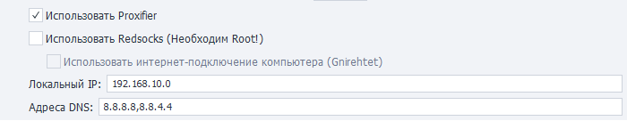

---
sidebar_position: 11
title: Проксирование трафика (Enterprise)
description: Проксирование трафика на реальном устройстве. 
---  
:::info **Пожалуйста, ознакомьтесь с [*Правилами использования материалов на данном ресурсе*](../Disclaimer).**
:::
_______________________________________________  
## Описание.  
ZennoDroid позволяет выбрать способ проксирования трафика для выполнения экшена [**Установка прокси**](../Android/Enterprise/setting#как-поставить-прокси).  

Параметры задаются на вкладке ***Настройки Android***. По умолчанию используется **Proxifier**.  

    
_______________________________________________ 
### [Proxifier](https://proxifier.com/).  
Это мощная и гибкая программа для перенаправления интернет-трафика через прокси-сервер. Она позволяет приложениям, которые не поддерживают работу через прокси, использовать его.   

Используется интернет-подключение компьютера. Весь трафик с телефона заворачивается в VPN с помощью Gnirehtet и передаётся на ПК, где уже проксируется через приложение Proxifier.  

:::tip **Gnirehtet — это инструмент, который позволяет раздавать интернет с компьютера на Android-устройство.**
Работает, как привычная всем "точка доступа", но с обратным смыслом. Это полезно в ситуациях, когда у вашего телефона нет мобильного интернета или доступа к Wi-Fi, но ваш компьютер подключен к сети.  

Программа работает через USB-кабель или по беспроводной сети и не требует root-прав на устройстве. 
:::
__________________________________________ 
### Redsocks.  
Данная утилита нужна для перенаправления сетевого трафика через прокси-сервер, минуя необходимость ручной настройки прокси в каждом отдельном приложении. Выполняется прозрачный редиректор TCP/UDP-соединений в прокси.  

:::warning **Работает только на устройствах с Root.**
:::  

По умолчанию DNS-запросы будут направляться через прокси-сервер. Поэтому если ваши запросы будут блокироваться (не подключается к интернету или возникает ошибка **`DNS_PROBE_FINISHED_NO_INTERNET`**), то необходимо отключить перенаправление.  

:::info **С# код для отключения перенаправления DNS-запросов.**  
```csharp
instance.DroidInstance.Proxy.UseDnsTcp = false;
instance.DroidInstance.Proxy.UseDnsUdp = false;  
```  
**Этот код необходимо выполнить перед установкой прокси.**
:::  
__________________________________________
### Использовать интернет-подключение компьютера (Gnirehtet).  
Если эта настройка выключена, то весь интернет-трафик будет передоваться через Wi-Fi подключение телефона.  

Но при её включении весь трафик с телефона начинает заворачиваться в VPN с помощью Gnirehtet и передаваться на компьютер.  

:::warning **Обязательно выключите передачу данных на телефоне.**
Мы рекомендуем так сделать, если для проксирования трафика используется интернет-подключение компьютера. Это поможет избежать случайной утечки трафика в сеть через Wi-Fi или мобильный интернет смартфона. 
:::  
_______________________________________________
### Локальный IP. 
:::tip **Задать локальный IP можно при использовании Proxifier, либо Redsocks + Gnirehtet.**
:::  

Здесь задаётся локальный IP-адрес устройства.  

Если указать последнее число равным нулю *(например, 192.168.20.0)*, то будет сгенерирован случайный адрес из указанной подсети *(192.168.20.2-192.168.20.254)*.  

:::info **С# код для установки локального IP-адреса у каждого потока в отдельности.**  
```csharp
instance.DroidInstance.Proxy.SetLocalAddress("192.168.50.0");  
```
**Этот код необходимо выполнить перед установкой прокси.**
::: 

### Адреса DNS.  
При использовании Redsocks можно настроить адреса DNS-сервера. Если их несколько, то разделять нужно запятой `,`  

Все DNS-запросы будут направляться через прокси-сервер.  

:::info **С# код для указания DNS-сервера у каждого потока в отдельности.**  
```csharp
instance.DroidInstance.Proxy.SetDnsServers("8.8.8.8,8.8.4.4"); 
```  
**Этот код необходимо выполнить перед установкой прокси.**
:::  
_______________________________________________ 