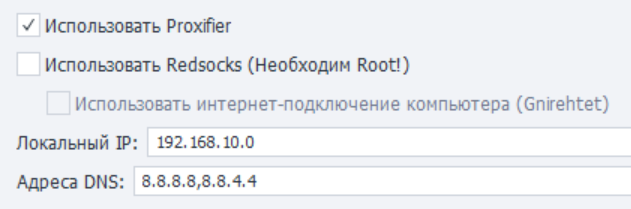

:::info **Пожалуйста, ознакомьтесь с [*Правилами использования материалов на данном ресурсе*](../Disclaimer).**
:::
_______________________________________________  
## Описание.  
На этой вкладке находятся различные параметры для настройки реального устройства на базе Android. Они также подходят, если вы работаете с эмулятором Bluestacks.  

_______________________________________________     
### Использовать устройство по умолчанию.  
Эта настройка позволяет выбрать устройство, которое будет использоваться по умолчанию в Project Maker — при условии, что не выбрано другое устройство. При этом данное устройство будет игнорироваться ZennoDroid'ом при случайном выборе из списка доступных.  

Если вы хотите использовать выбранное устройство при выполнении проектов в ZennoDroid, то необходимо отключить эту настройку, чтобы не возникало ошибки ***Устройство занято в Project Maker***.
:::info **Кнопка «Обновить» позволяет обновить список доступных устройств**
::: 
  
### Использовать MJPEG для захвата изображения.    
Альтернативный способ захвата изображения с устройства. Эту настройку стоит включать только в том случае, если при запуске устройства через ZennoDroid процесс всегда завершается ошибкой, а в логе появляется запись ***Не удалось захватить изображение***.  
_______________________________________________ 
### Время ожидания загрузки устройства.  
С помощью этой настройки можно задать тайм-аут ожидания подключения к устройству. 
_______________________________________________ 
### Случайное отклонение клика.  
Позволяет делать клики с небольшим отклонением от заданных параметров. Используется в экшенах:  
- [**Поиск по картинке**](../pm/Creating/SearchByPic). Нажатие на экран будет осуществляться не в точное место, а с небольшим смещением.  
- [**Выполнить событие**](../Android/ProLite/RunEvent). Если для координат нажатия выбран **Центр**, то нажатие на элемент будет произведено не точно, а с небольшим отклонением.  
_______________________________________________
### Случайное отклонение при вводе символов.  
Используется в экшенах [**Эмуляция клавиатуры**](../Android/ProLite/Keyboard) и [**Установка значения**](../Android/ProLite/SetValue). Позволяет настроить отклонение задержки от заданного значения.  

Например, если задана задержка 150 мс, а отклонение 10%, то реальная задержка при вводе каждого символа составит от 135 мс до 165 мс.  
_______________________________________________ 
### Задержка перед и после ввода символов.  
Как и прошлый параметр, используется в действиях [**Эмуляция клавиатуры**](../Android/ProLite/Keyboard) и [**Установка значения**](../Android/ProLite/SetValue) для установки задержки.  
_______________________________________________ 
### Проксирование трафика (Proxifier и Redsocks).  
ZennoDroid позволяет выбрать способ проксирования трафика для выполнения экшена [**Установка прокси**](../Android/ProLite/setting#как-поставить-прокси). По умолчанию используется Proxifier.  

 
_______________________________________________ 
### Отключение анимации.
Этот пункт позволяет вам выключить все анимации системы. Мы рекомендуем поставить здесь галочку, так как плавные переходы сильно замедляют работу устройства.  
_______________________________________________ 
### Способ ввода символов.  
Настройка позволяет выбрать наиболее подходящий способ эмуляции ввода символов:  
- **ADBKeyboard**.  
- **AccessibilityService**.  
- **Native input + Clipboard**.  
- **Input text**.  
:::info **Первые три способа выводят любые символы, включая кириллицу и эмодзи. Последний же только ASCII символы.**
:::   
_______________________________________________
### Использование фиктивных местоположений.  
Данный параметр нужен для подмены местоположения устройства через экшен [**Установка Geo-позиции**](../Android/Enterprise/Utilities_Ent#установка-geo-позиции).  
_______________________________________________
### Настройки для устройств с Root.  
Эти настройки необходимы для экшенов [**Сохранить/восстановить данные приложения**](../Android/Enterprise/App#сохранить-данные-приложения). Мы не рекомендуем менять эти параметры без необходимости.  

Команда `su` позволяет указать путь и параметры для запуска команд с привилегиями суперпользователя. По умолчанию: `su -c`.  

Настройка **Путь к busybox** позволяет указать путь к файлу busybox.  
По умолчанию: `/sbin/.magisk/busybox/busybox`.  
_______________________________________________  
## Полезные ссылки.
- [**Подключение реального устройства (ZDE)**](../Enterprise/Connection).