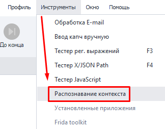
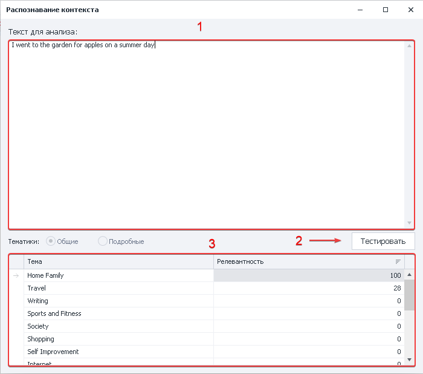

:::info **Пожалуйста, ознакомьтесь с [*Правилами использования материалов на данном ресурсе*](../Disclaimer).**
:::
_______________________________________________ 
## Описание.  
Инструмент позволяет проверить корректность работы экшена [**Создание контента**](../Data/ContentCreator) перед использованием в проекте. Занимается определением тематики текста и минимальных границ релевантности.  

:::info *Работает **только** с английским языком.*
:::
### Как открыть?  
#### Через Панель инструментов.  
   

_______________________________________________  
## Как работать с инструментом?  
### Обзор окна.  
   

**1**. Тут задаём желаемый текст для анализа в соответствующем поле.  
**2**. Нажатием на кнопку **Тестировать** запускаем процесс обработки текста.  
**3**. Снизу отобразится результат с различными тематиками и их соответствием с текстом в процентах.  
_______________________________________________  
## Полезные ссылки.   
- [**Модули создания контента**](../Settings/Creator_and_GoogleSheets).  
- [**Создание контента**](../Data/ContentCreator).   
- [**Анализ содержимого**](../Project%20Editor/ContextRecognition).