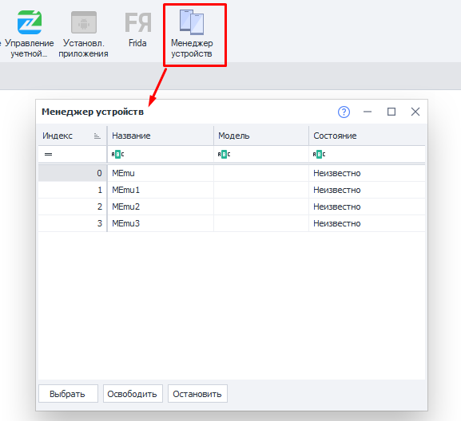
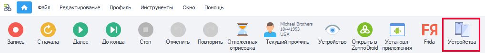
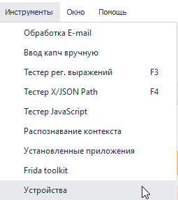
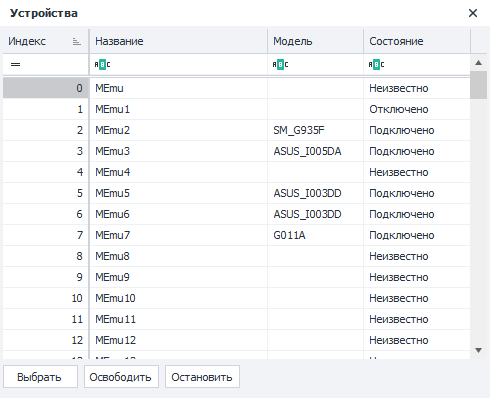
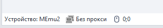

:::info **Пожалуйста, ознакомьтесь с [*Правилами использования материалов на данном ресурсе*](../Disclaimer).**
:::
_______________________________________________  
## Memu.  
  

В данном окне отображаются все виртуальные устройства, созданные в MEmu. Здесь можно получить краткую информацию о них и быстро переключиться между ними.  

### Как его открыть?  
Есть два способа.  
#### Через Панель инструментов.  
  

#### В выпадающем списке раздела «Инструменты».  

### Описание доступных элементов.  
  

#### Колонки:  
- **Индекс**. Порядковый номер устройства.  
- **Название**. По умолчанию все устройства проименованы в формате `MEmu+Индекс`. Но для удобства распознавания вы можете задать более конкретное имя. Сделать это можно:  
    - нажав на нужную ячейку + F2,  
    - через экшен [**Переименовать**](../Android/ProLite/action#как-переименовать-устройство).  
- **Модель**. Тут указывается модель телефона. Информация отображается только для подключённых в данный момент устройств.  
- **Состояние**. Статус подключения эмулятора.  
    - *Подключено*. Всё в порядке, с устройством можно работать.  
    - *Отключено*. Эмулятор запущен, но ZennoDroid не может с ним взаимодействовать.  
    Возможные пути решения:  
        - *перезагрузить устройство*,  
        - *удалить устройство*,  
        - *создать новое устройство*.  
    - *Неизвестно*. Эмулятор остановлен.  

#### Кнопки:  
- **Выбрать**. Сделает активным устройство, которое выбрано в таблице.  
Используется для быстрого переключения между подключенными устройствами.  
Название выбранного устройства также отображается в панели состояния:  
  
- **Освободить**. Останавливает активное устройство и полностью отключает его от использования.  
Строка в панели состояния при этом становится пустой.  
Используется для устранения ошибки **Устройство занято в ProjectMaker**, когда нет возможности переключиться на другое.  
- **Остановить**. Останавливает активное устройство, которое при этом продолжает считаться выбранным.  
Используется в качестве альтернативы для экшена [**Остановить**](../Android/ProLite/action#как-остановить-устройство).
_______________________________________________  
## Полезные ссылки.   
- [**Действия с устройством**](../Android/ProLite/action).  
- [**Окно устройства**](../pm/Interface/DeviceWindow).   
