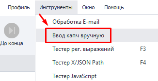
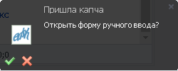
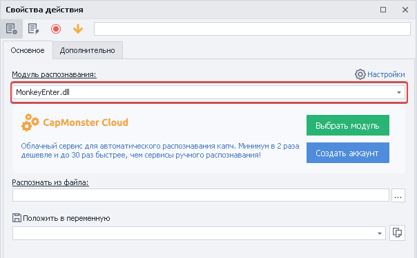
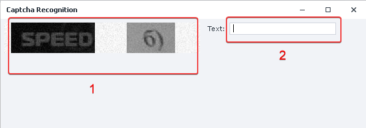
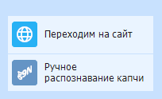

:::info **Пожалуйста, ознакомьтесь с [*Правилами использования материалов на данном ресурсе*](../Disclaimer).**
:::
_______________________________________________   
## Описание.  
С каждым днём защита сайтов и приложений в виде капч усложняет массовое выполнение проектов. Если у вас нет подходящего сервиса для их решения, либо планируемые объемы совсем не большие, то вы можете разгадывать капчи вручную.  

:::tip **[CapMonster Cloud](https://capmonster.cloud/Dashboard).**
Поможет вам с решением **HCaptcha**, **Cloudflare**, **ReCaptcha Enterprise** и других сложных капч. Потому что этот экшен работает только с простыми текстовыми задачами.
:::

### Как открыть?  
Есть два способа.  
#### Через Панель инструментов.  
  

#### Через всплывающее окно в правом нижнем углу.  
  

*Оно появляется при отправке картинки из экшена [**Распознать капчу**](../Android/ProLite/CaptchaSolving)*.  
_______________________________________________
## Как работать с инструментом?  
### Подготовка.  
Добавляем в проект экшен [**Распознать капчу**](../Android/ProLite/CaptchaSolving) и выбираем из списка модуль распознавания **`MonkeyEnter.dll`**.  

  

### Разгадывание капчи.  
  

**1.** Отправляем капчу, которую необходимо разгадать.  
**2.** Вводим результат.  

После этого нажимаем **Enter**, подтверждая результат. Ответ при этом внесётся в переменную, которая задаётся при настройке экшена [**Распознать капчу**](../Android/ProLite/CaptchaSolving).  

:::tip **Данный способ подходит только для текстовых капч.**
:::  
_______________________________________________
## Пример использования.  
Подведём итог. Представим, что нужно отправить сообщение на форуме, где установлена текстовая капча.  

  

1. Добавляем в проект экшен [**Распознать капчу**](../Android/ProLite/CaptchaSolving).  
2. Выбираем модуль распознавания **`MonkeyEnter.dll`**.  
3. Открываем окно ввода капчи.  
4. Вводим ответ на задачу.  
5. Подтверждаем результат и отправляем сообщение.  

Таким образом, если вам во время работы попадётся текстовая капча, то вы сможете решить её таким способом.
_______________________________________________  
## Полезные ссылки.   
- [**Настройка модулей капч**](../Settings/Captcha).  
- [**Распознать капчу**](../Android/ProLite/CaptchaSolving).   
- [**Обработка изображений**](../Data/Images).